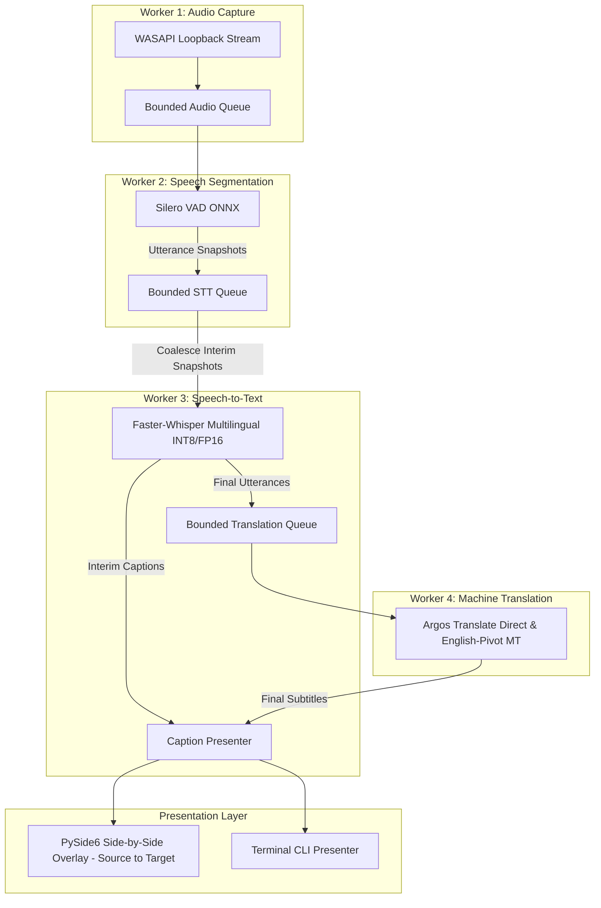

# Architecture: CapTran (`captran`)

## Overview

`captran` is designed using **Hexagonal Architecture (Ports and Adapters)**. The application captures system/meeting audio output, detects speech utterances via offline VAD, transcribes speech across 7 supported languages with local Faster-Whisper, translates offline with local Argos Translate (via direct models or automated 2-hop English pivot routing across all 42 language pairs), and displays live side-by-side subtitles—**with zero cloud or network dependencies** once offline models/assets are loaded locally.

---

## The Dependency-Direction Rule

The fundamental architectural constraint is:

> **All source code dependencies point inward toward the domain.**
> - Domain has **zero** external dependencies.
> - Application depends **only on Domain**.
> - Infrastructure depends on **Domain port interfaces**, **never** the reverse.
> - The Domain and Application layers are completely decoupled from third-party libraries, audio drivers, ML runtimes, OS subsystems, and UI frameworks.

```text
       +-------------------------------------------------------------------+
       |                         INFRASTRUCTURE                            |
       |  (WASAPI Audio, Silero VAD, Faster-Whisper, Argos MT, PySide6)    |
       |                                 |                                 |
       |                                 v (implements)                    |
       |  +-------------------------------------------------------------+  |
       |  |                         APPLICATION                         |  |
       |  |           (LiveCaptionUseCase, LatencyTracker)              |  |
       |  |                              |                              |  |
       |  |                              v                              |  |
       |  |  +-------------------------------------------------------+  |  |
       |  |  |                        DOMAIN                         |  |  |
       |  |  |    (Entities, Value Objects, Ports, Vocabulary)       |  |  |
       |  |  +-------------------------------------------------------+  |  |
       |  +-------------------------------------------------------------+  |
       +-------------------------------------------------------------------+
```

---

## Decoupled Multi-Threaded Pipeline Architecture

To guarantee that slow neural network inference steps never block real-time audio capture or introduce queue drift during continuous speech, `LiveCaptionUseCase` implements an asynchronous **Producer-Consumer pipeline** connected by bounded queues:



### Backpressure & Coalescing Strategy
1. **Interim Snapshot Coalescing**: When audio arrives faster than STT can infer on CPU, older pending interim frames in `_stt_queue` are purged to immediately process the freshest audio frame, preventing subtitle latency drift.
2. **Final Segment Preservation**: Finalized speech segments are never dropped. If `_stt_queue` is full, pending interim chunks are evicted to guarantee room for the finalized segment.
3. **Blocking Sentinels & Graceful Shutdown**: `None` sentinels use timed blocking puts so all workers finish processing and shut down cleanly without hanging.

---

## Layer Responsibilities

### 1. `src/domain/`
- **Pure Python standard library only.**
- **Entities & Value Objects**:
  - `AudioChunk`: Immutable PCM slice with sample rate, channels, timestamp, and `is_final` flag.
  - `TranscriptSegment`: Transcribed text segment with timestamps, confidence, and language code.
  - `CaptionSegment`: Presentation-ready subtitle containing target translation (`text`) and source speech (`original_text`).
  - `Language`: Standardized language enumeration (`hi`, `ja`, `en`, `es`, `fr`, `de`, `ko`).
  - `CustomVocabulary`: Domain terms, prompt hints, and regex-safe pre/post-translation substitutions.
  - `Settings`: User preferences (font size, opacity, audio device, dual subtitles, VAD sensitivity).
  - `PipelineStatus`: Operational status (`idle`, `running`, `reconnecting`, `degraded`, `stopped`, `error`).
- **Ports (Abstract Interfaces)**:
  - `AudioSource`: Interface for capturing live audio streams.
  - `SpeechSegmenter`: Interface for voice activity detection (VAD).
  - `Transcriber`: Interface for offline speech-to-text.
  - `Translator`: Interface for offline machine translation.
  - `CaptionPresenter`: Interface for subtitle presentation (GUI overlay or CLI).
  - `CustomVocabularyRepository`: Interface for domain dictionary persistence.
  - `SettingsRepository`: Interface for user settings persistence.

### 2. `src/application/`
- `live_caption_use_case.py`: Coordinates the 4 worker threads, queue backpressure, error recovery, and automatic device reconnection.
- `latency_tracker.py`: Thread-safe stage latency timing instrumentation calculating running percentiles (p50, p95, min, max, avg) and emitting periodic diagnostic summaries.

### 3. `src/infrastructure/`
Contains concrete adapters that implement domain ports:
- `infrastructure/audio/`: Windows WASAPI loopback audio capture via `pyaudiowpatch` and `AudioSourceFactory`.
- `infrastructure/audio/silero_vad.py`: Offline ONNX Silero VAD segmenter with interim emission support.
- `infrastructure/stt/faster_whisper_stt.py`: CTranslate2 INT8/float16 Faster-Whisper transcriber supporting 7 languages.
- `infrastructure/translation/`:
  - `argos_translator.py`: Direct offline Argos Translate model adapter.
  - `pivoting_translator.py`: Automated 2-hop English-pivot translator supporting all 42 pair combinations.
  - `adapter.py`: Offline translation adapter wrapping direct/pivot routing.
- `infrastructure/vocabulary/json_custom_vocabulary.py`: Disk-persisted custom dictionary at `~/.ja-en-captioner/custom_vocab.json`.
- `infrastructure/ui/`:
  - `overlay_presenter.py`: PySide6 frameless, draggable, translucent 2-column side-by-side overlay with HTML escaping.
  - `control_window.py`: Desktop settings & device selector control panel.
  - `console_presenter.py`: Terminal presenter supporting in-place interim updates and dual subtitles.
- `infrastructure/settings/`: Local JSON configuration repository (`local_settings_repository.py`).

### 4. Composition Roots
- `src/composition_root_gui.py`: Wires together GUI adapters, settings persistence, and background worker threads.
- `src/composition_root_cli.py`: Assembles multilingual adapters for headless terminal execution.
- `src/composition_root.py`: Dependency injection container and factory functions.
- `main.py`: Top-level CLI entry point and argument dispatcher.

---

## Directory Layout

```text
captran/
├── pyproject.toml
├── README.md
├── LICENSE
├── ARCHITECTURE.md
├── BUILD_WINDOWS.md
├── captran.spec
├── main.py
├── models/
│   ├── silero_vad.onnx
│   ├── whisper/
│   └── argos_packages/
├── scripts/
│   ├── setup_models.py
│   ├── check_argos_coverage.py
│   ├── sweep_vad_params.py
│   ├── prepare_offline_models.py
│   ├── install_translation_model.py
│   ├── bench_latency.py
│   ├── bench_pipeline.py
│   └── test_capture_windows.py
├── src/
│   ├── domain/
│   │   ├── entities.py
│   │   └── ports.py
│   ├── application/
│   │   ├── live_caption_use_case.py
│   │   └── latency_tracker.py
│   ├── infrastructure/
│   │   ├── audio/
│   │   ├── stt/
│   │   ├── translation/
│   │   ├── ui/
│   │   ├── vocabulary/
│   │   └── settings/
│   ├── composition_root.py
│   ├── composition_root_cli.py
│   └── composition_root_gui.py
└── tests/
    ├── domain/
    ├── application/
    ├── infrastructure/
    ├── data/
    ├── test_composition_root.py
    ├── test_composition_root_cli.py
    ├── test_composition_root_gui.py
    └── test_multilingual_pipeline_integration.py
```
