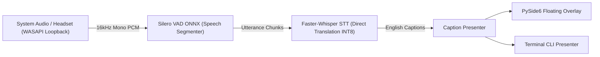

# CapTran (Japanese ➔ English Live Offline Captioner [ja->en])

[](https://opensource.org/licenses/MIT)
[](https://www.python.org/downloads/)
[](ARCHITECTURE.md)
[](https://docs.microsoft.com/en-us/windows/win32/coreaudio/wasapi)

**CapTran** is a high-performance, **100% offline, privacy-first Japanese-to-English live meeting and audio captioner** built with clean Hexagonal Architecture (Ports and Adapters). 

It captures live system audio (meetings, browser tabs, video streams, YouTube, or podcasts) via Windows WASAPI Loopback, detects speech utterances in real time using local **Silero VAD**, performs direct end-to-end speech translation via CTranslate2-accelerated **Faster-Whisper (INT8 optimized)**, and renders live subtitles on a modern translucent, draggable overlay.

---

## 🌟 Key Features

- **100% Offline & Private:** Zero cloud API calls or runtime data leakage. All neural network inferences run locally.
- **Ultra-Low Latency Inference:**
  - Quantized **INT8 computation** leveraging AVX2/AVX-512 vector acceleration.
  - Greedy decoding (`beam_size=1`) and adaptive VAD slicing (~250ms latency).
- **Direct Speech Translation:** Uses Whisper's native `ja->en` speech-to-text translation model for conversational fluency.
- **System Audio Loopback:** Captures internal speaker and Bluetooth/headset output directly without needing a physical microphone.
- **Dual Presentation Modes:**
  - **Modern GUI:** Draggable, translucent, always-on-top glassmorphic overlay + dark-themed Control Panel.
  - **Headless CLI:** Terminal-based overwrite presenter with timestamp logs for low-overhead or remote environments.
- **Hexagonal Architecture:** Domain core is strictly decoupled from third-party libraries (PySide6, faster-whisper, onnxruntime, pyaudiowpatch) via pure Python ports.

---

## 🏛️ Pipeline Architecture



---

## 🚀 Quick Start Guide

### 1. Prerequisites
- **Operating System:** Windows 10 or Windows 11 (64-bit)
- **Python Version:** Python 3.11 or higher
- **Hardware:** Modern multi-core CPU (Intel/AMD) or NVIDIA GPU (optional)

### 2. Clone & Setup Environment

```powershell
# Clone repository
git clone https://github.com/your-username/captran.git
cd captran

# Create virtual environment
python -m venv .venv
.venv\Scripts\Activate.ps1

# Install package and dependencies
pip install -e .
```

### 3. Model Assets Setup (One-Time)
Before running for the first time, prepare local model weights:

```powershell
# Pre-download Silero VAD and Whisper models ('tiny' and 'small')
python scripts/prepare_offline_models.py
```

---

## 💻 How to Run

### Mode 1: Graphical User Interface (Default)
Launch the desktop control window and draggable subtitle overlay:

```powershell
python main.py
```
- **Select Audio Device:** Choose your default speakers or connected headphones/Bluetooth headset from the dropdown.
- **Select Model Size:** Choose between `tiny` (fastest) and `small` (higher accuracy).
- **Start/Stop:** Click **Start Live Captioning** to begin streaming.

---

### Mode 2: Terminal / Headless CLI Mode
For developers or lightweight terminal usage:

```powershell
# Fast real-time translation using 'tiny' model
python main.py --cli --model-size tiny

# Higher accuracy translation using 'small' model
python main.py --cli --model-size small
```

---

### Mode 3: Headset & Audio Device Selection
If using headphones or Bluetooth earbuds:

1. **List all available loopback capture devices:**
   ```powershell
   python main.py --list-devices
   ```
   *Example Output:*
   ```text
   Available Loopback Devices (2 found):
     [16] Speakers (Realtek(R) Audio) [Loopback] (2 ch, 48000 Hz)
     [17] Headphones (Boult Audio Airbass) [Loopback] (2 ch, 44100 Hz)
   ```

2. **Run specifically on your headset (e.g., Device 17):**
   ```powershell
   python main.py --cli --device-index 17 --model-size tiny
   ```

---

## ⚙️ Command-Line Options

| Flag | Default | Description |
| :--- | :--- | :--- |
| `--cli` | `False` | Run in terminal CLI mode instead of PySide6 GUI |
| `--list-devices` | `False` | Enumerate available WASAPI loopback audio capture devices and exit |
| `--device-index` | `Auto` | WASAPI loopback device index (auto-detects active audio output) |
| `--model-size` | `small` | Faster-Whisper model size (`tiny`, `base`, `small`) |
| `--compute-type` | `int8` | Model quantization (`int8`, `float16`, `float32`, `default`) |
| `--beam-size` | `1` | Beam search size (`1` for real-time greedy decoding) |
| `--vad-threshold` | `0.4` | Silero VAD speech activation sensitivity (0.1 to 0.9) |
| `--silence-timeout`| `250.0` | Silence duration (ms) to finalize an utterance chunk |
| `--task` | `translate`| Whisper task: `translate` (direct JA->EN) or `transcribe` |
| `--no-timestamps` | `False` | Omit timestamp prefixes in CLI mode |

---

## 🧪 Running Tests

CapTran includes unit and integration test suites with zero external cloud dependencies:

```powershell
# Run all unit tests
pytest

# Run tests with verbose output
pytest -v
```

---

## 📦 Building Standalone Windows Executable

To bundle CapTran into a single portable offline folder with PyInstaller:

```powershell
# 1. Install development dependencies
pip install -e .[dev]

# 2. Stage offline model weights
python scripts/prepare_offline_models.py

# 3. Build executable
pyinstaller captran.spec --clean --noconfirm
```

The resulting standalone distribution will be generated inside `dist/captran/captran.exe`.

---

## 📁 Repository Structure

```text
captran/
├── main.py                     # Primary Application Entry Point (CLI/GUI dispatch)
├── pyproject.toml              # Build config and dependencies
├── LICENSE                     # MIT Open Source License
├── ARCHITECTURE.md             # Comprehensive Hexagonal Architecture documentation
├── BUILD_WINDOWS.md            # Windows Standalone PyInstaller build instructions
├── captran.spec                # PyInstaller specification file
├── models/                     # Local offline weights directory
│   ├── silero_vad.onnx         # Offline Silero VAD model
│   └── whisper/                # CTranslate2 Whisper model cache
├── scripts/                    # Helper scripts
│   ├── prepare_offline_models.py
│   ├── install_translation_model.py
│   └── test_capture_windows.py
├── src/
│   ├── domain/                 # Pure domain entities, value objects & abstract ports
│   ├── application/            # Orchestration & LiveCaptionUseCase
│   ├── infrastructure/         # Concrete adapters (WASAPI, VAD, Whisper, GUI, CLI)
│   ├── composition_root.py     # Clean dependency injection root
│   ├── composition_root_cli.py # CLI application assembler
│   └── composition_root_gui.py # PySide6 GUI application assembler
└── tests/                      # Automated test suite (Unit & Integration)
```

---

## 📄 License

This project is licensed under the **MIT License** - see the [LICENSE](LICENSE) file for details.
